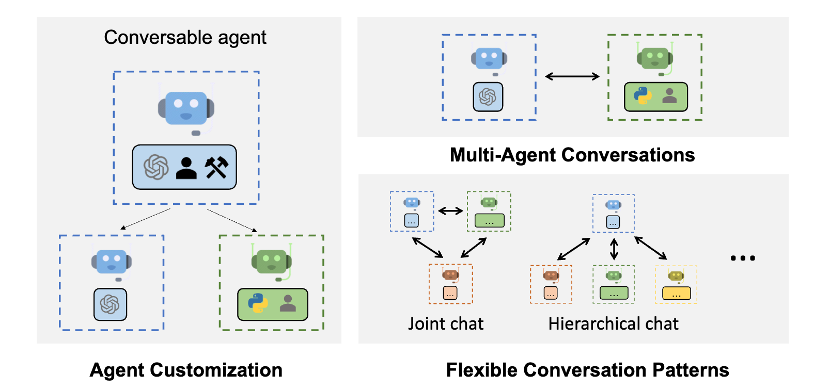
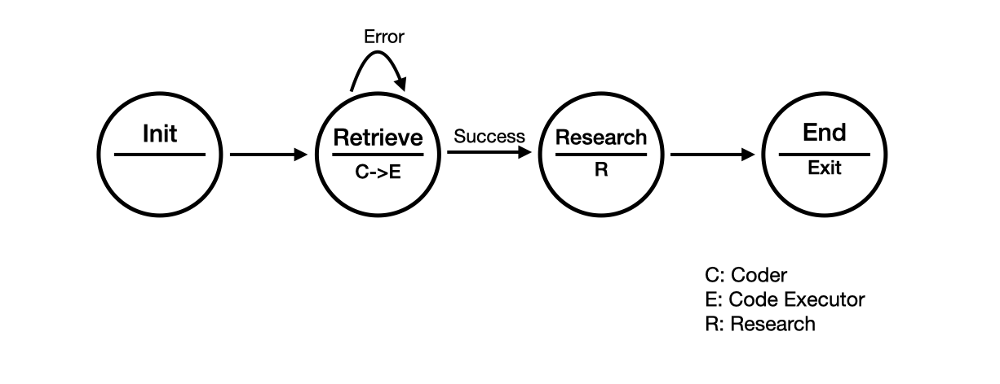

# AutoGen 教学案例

本目录用 Notebook 演示多 Agent 协作、工具调用、代码执行和 RAG。它包含两条**不能混装**的学习路径：旧版 PyAutoGen 示例与 AutoGen 0.4.7 教程。

## 选择正确的路径

| 路径 | 入口 | 适用内容 | 依赖清单 |
| --- | --- | --- | --- |
| Legacy PyAutoGen | autogen.ipynb、autogen_rag.ipynb | GroupChat、定制 Speaker、RetrieveChat 风格 RAG | requirements-legacy.txt |
| AutoGen 0.4.7 | tutorial/tutorial_autogen_0_4_7_version.ipynb | 新版 AgentChat API 与 0.4 教程 | requirements-0.4.txt |
| 基础 Notebook | tutorial/ 下其他 Notebook | Code Executor、ConversableAgent、Tools、UserProxyAgent | 依其 API 世代选择环境 |

不要在同一个虚拟环境同时安装 legacy 和 0.4 依赖。两代 API 的模块名、对象模型和示例代码不兼容。

## 环境准备

建议为每条路径创建单独环境，并安装 Jupyter：

~~~
cd AutoGen
python3 -m venv .venv-legacy
source .venv-legacy/bin/activate
python3 -m pip install -r requirements-legacy.txt
jupyter lab
~~~

学习 0.4.7 教程时，请改用 requirements-0.4.txt 与另一份虚拟环境。Notebook 文件名中包含版本号，是选择依赖的依据。

## 模型服务前置条件

大部分示例需要一个 OpenAI 兼容聊天接口。openai_api.sh 是 FastChat 的**历史参考启动脚本**，其中包含作者机器上的模型路径：

~~~
bash openai_api.sh
~~~

运行前必须把模型路径、模型名、端口和 GPU 数量改为自己的环境。该脚本默认将 OpenAI 兼容 API 暴露在 8000/v1；如果使用 vLLM、云服务或其他兼容服务，只需在 Notebook 的模型配置中填入对应地址和密钥。

## 推荐学习顺序

1. 先打开 tutorial/ConversableAgent.ipynb 和 tutorial/Tools.ipynb，理解 Agent 的消息与工具接口。
2. 再学习 autogen.ipynb：它演示 Initializer、Coder、Executor、Scientist 的 StateFlow/Speaker 协作。
3. 需要知识库增强时运行 autogen_rag.ipynb，并准备自己的文本与向量库。
4. 最后切换到 tutorial/tutorial_autogen_0_4_7_version.ipynb，比较新版 API 与 legacy API 的差异。

## 代码执行安全

部分案例会让 Executor 或 UserProxyAgent 执行模型生成的代码。仅在隔离的本地环境、容器或受限沙箱中运行；不要让示例访问生产密钥、个人文件或具有高权限的网络环境。

## 常见问题

- ImportError 或 API 不一致：通常是把 legacy 与 0.4 包装到了同一个环境。请重新创建隔离环境。
- 连接不到模型：检查 Notebook 中的 base URL、模型名、API Key 和服务监听端口。
- RAG 初始化失败：确认向量库依赖版本、文档路径和嵌入模型配置一致。
- 代码执行失败：先检查执行器工作目录、Python 环境和权限，再查看 Agent 的中间消息。

## 延伸阅读

- [AutoGen Getting Started](https://microsoft.github.io/autogen/docs/Getting-Started)
- [AutoGen 论文](https://arxiv.org/abs/2308.08155)

