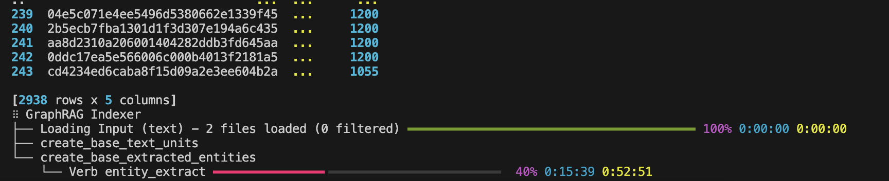
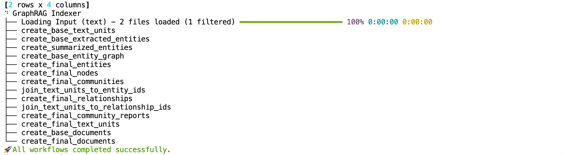
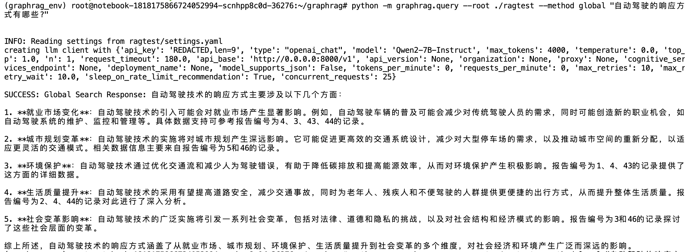
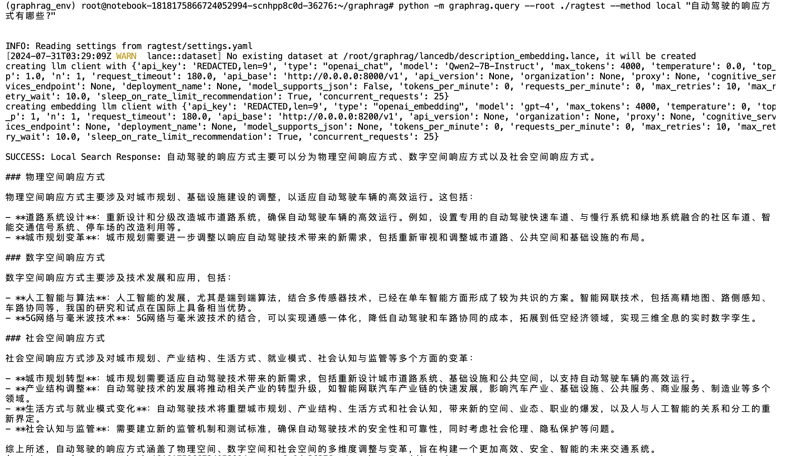

# GraphRAG 教学案例

本目录记录 GraphRAG 的索引、查询、Parquet 产物和 Neo4j 可视化实验。它是一个**版本敏感的实验案例**：GraphRAG 的配置格式、CLI 和模型要求变化较快，请把本文档视为学习路径与历史实验说明，而不是一键部署脚本。

原始实验使用 Qwen2-7B-Instruct、bge-m3、CHLAWS 数据集和单张 A800-80G。学习者可替换为自己的兼容模型、嵌入服务和文本数据。

## 目录地图

| 路径 | 内容 | 用途 |
| --- | --- | --- |
| input/ | 示例文本输入 | 新建索引时的原始文档参考 |
| data/ | 已生成的 GraphRAG Parquet 产物 | 理解实体、关系、社区和报告的输出结构 |
| notebook/global_search.ipynb | 全局检索 Notebook | 阅读社区级主题总结流程 |
| notebook/local_search.ipynb | 局部检索 Notebook | 阅读实体和关系局部检索流程 |
| neo4j_display/ | Neo4j 可视化 Notebook 与说明 | 将图谱导入 Neo4j 浏览 |
| report.md | 历史实验记录 | 排错和服务配置参考 |

## 环境与服务

GraphRAG 索引通常应与聊天模型服务、嵌入模型服务隔离。建议至少准备三个环境：

1. 聊天模型服务：提供 OpenAI 兼容 chat completions 接口。
2. 嵌入模型服务：提供 OpenAI 兼容 embeddings 接口。
3. GraphRAG CLI / Notebook：安装本目录 requirements.txt，并配置上面两个服务。

~~~
cd GraphRAG
python3 -m venv .venv
source .venv/bin/activate
python3 -m pip install -r requirements.txt
~~~

requirements.txt 覆盖 GraphRAG CLI、Notebook 和 Neo4j 可视化的最小依赖。vLLM、FastChat、模型权重和 GPU 驱动由外部环境负责，不在此依赖清单内。

## 端点约定

历史文档中的默认端点仅作示例：

| 服务 | 示例地址 | 说明 |
| --- | --- | --- |
| 聊天模型 | http://127.0.0.1:8000/v1 | 用于抽取、摘要和回答 |
| 嵌入模型 | http://127.0.0.1:8200/v1 | 用于文本向量化 |
| Neo4j | bolt://127.0.0.1:7687 | 可选，仅用于图谱浏览 |

请在自己的 GraphRAG settings 配置中替换 API Key、模型名、地址和并发设置。较弱的模型可能无法稳定产出 JSON 或足够连通的实体图，因此需要降低并发、增大模型或改进输入文本。

## 两条学习路径

### A. 查询已有产物

本目录已保留 data/ 中的历史 Parquet 输出，适合先了解 GraphRAG 生成了哪些表和字段。打开 global_search.ipynb 或 local_search.ipynb 前，先检查其 INPUT_DIR 配置。

当前 Notebook 的历史 INPUT_DIR 指向 output/20240807-093938/artifacts。它不是一个自动发现目录；请手动改为仓库中的 data/，或改为你自己的 GraphRAG artifacts 目录，然后再运行相应单元格。

这条路径主要用于理解查询流程，未必与当前安装的 GraphRAG 版本完全兼容。

### B. 从自己的文本重新索引

推荐在新工作区操作，不覆盖仓库内历史产物：

~~~
mkdir -p ./ragtest/input
# 将自己的 TXT 文档放入 ragtest/input/
python -m graphrag.index --init --root ./ragtest
~~~

初始化会生成配置和本地环境文件。填写聊天模型与嵌入服务后，再执行：

~~~
python -m graphrag.index --root ./ragtest
~~~

索引管线示例：

完成索引示例：

具体参数因 GraphRAG 版本而异；如当前 CLI 与命令不匹配，请优先查阅所安装版本的官方文档，再将输出目录作为 Notebook 的 INPUT_DIR。

## 查询与可视化

完成索引后，可按所安装版本提供的 CLI 或 Notebook 进行全局、局部查询。全局查询适合“主题是什么”这类社区级问题；局部查询适合“某实体与谁有关”这类关系问题。

全局查询输出示例：

局部查询输出示例：

Neo4j 可视化请参阅 [neo4j_display/README.md](neo4j_display/README.md)。它需要单独运行 Neo4j，并在 Notebook 中填写本机数据库连接信息。演示用密码不是生产安全配置。

## 常见问题

- EmptyNetworkError：抽取出的实体/关系过少，图聚类无法形成网络。尝试改进文本、提高模型能力或检查模型输出格式。
- JSON 解析失败：部分本地模型不稳定支持结构化输出；按当前 GraphRAG 版本设置相应兼容选项，或使用更强模型。
- 查询找不到产物：检查 Notebook 的 INPUT_DIR 是否指向真实 artifacts 或 data/。
- 嵌入请求失败：确认 embeddings 服务路径、模型名和 OpenAI 兼容响应格式。
- 内存或显存不足：缩小输入、降低并发、分批索引，或使用更高资源的设备。

## 延伸阅读

- [Microsoft GraphRAG 入门文档](https://microsoft.github.io/graphrag/posts/get_started/)
- [Neo4j 可视化说明](neo4j_display/README.md)
