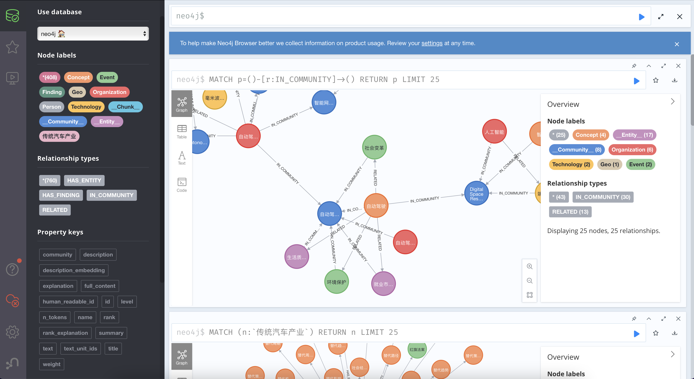

# Neo4j 可视化 GraphRAG 知识图谱

本目录演示如何把 GraphRAG 生成的实体和关系导入 Neo4j 并在浏览器中查看。它是 GraphRAG 教学案例的可选扩展，需要先有可用的 GraphRAG artifacts。

## 启动 Neo4j

以下命令使用 Neo4j 5.22 社区版与 APOC。将 replace-this-password 替换为仅用于本机实验的强密码；不要复用示例口令或把密码提交到仓库。

~~~
docker pull neo4j:5.22.0-community

docker run --rm --name neo4j-apoc \
  -p 7474:7474 -p 7687:7687 \
  -e NEO4J_AUTH=neo4j/replace-this-password \
  -e NEO4J_apoc_export_file_enabled=true \
  -e NEO4J_apoc_import_file_enabled=true \
  -e NEO4J_apoc_import_file_use__neo4j__config=true \
  -e NEO4J_PLUGINS='["apoc"]' \
  neo4j:5.22.0-community
~~~

打开 http://127.0.0.1:7474 可进入 Neo4j Browser。

## 配置 Notebook

在启动 Notebook 前，把密码放到环境变量中：

~~~
export NEO4J_PASSWORD="你的本机实验密码"
~~~

连接代码使用环境变量，而不是仓库中的固定口令：

~~~
import os
from neo4j import GraphDatabase

NEO4J_URI = "bolt://127.0.0.1:7687"
NEO4J_USERNAME = "neo4j"
NEO4J_PASSWORD = os.environ["NEO4J_PASSWORD"]
NEO4J_DATABASE = "neo4j"

driver = GraphDatabase.driver(
    NEO4J_URI,
    auth=(NEO4J_USERNAME, NEO4J_PASSWORD),
)
~~~

随后打开 neo4j_display.ipynb，按其中单元格导入 GraphRAG 输出。运行前检查 Notebook 中的 artifacts 路径、数据库地址和 GraphRAG 版本是否与自己的环境一致。

## 注意事项

- 此示例只适合本机学习。对外暴露 Neo4j 前应配置网络访问控制、TLS、强密码和持久化存储。
- 重新启动带 --rm 的容器会删除容器内数据；需要保留数据时挂载 Docker volume。
- 导入前先用小规模 artifacts 验证数据映射，避免一次写入大量节点和关系。

